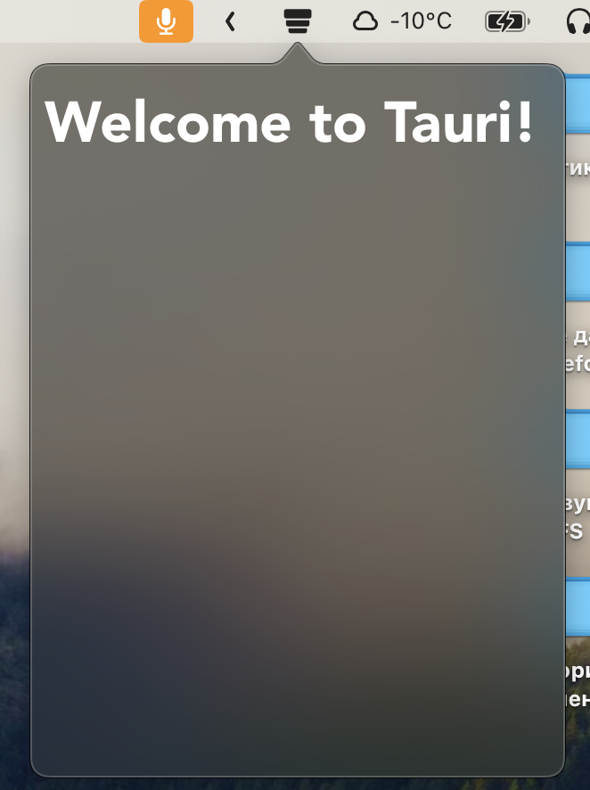

# Tauri Plugin NSpopover

Only for MacOS

<div style="display: flex; justify-content: center;">
  
</div>
<!--  -->

## How to use?

Cargo.toml

```toml
[dependencies]
tauri-plugin-nspopover = { git = "https://github.com/freethinkel/tauri-nspopover-plugin.git" }
```

main.rs

```rust
fn main() {
    tauri::Builder::default()
        .setup(|app| {
            let window = app.app_handle().get_window("main").unwrap();
            window.to_popover();
            Ok(())
        })
        .plugin(tauri_plugin_nspopover::init())
        .run(tauri::generate_context!())
        .expect("error while running tauri application");
}
```

tauri.config.json

```json

  "systemTray": {
    "iconPath": "./icons/statusbar-icon.png",
    "iconAsTemplate": true
  },
...
  "windows": [
    {
      "fullscreen": false,
      "resizable": true,
      "title": "inboxion",
      "width": 300,
      "height": 450,
      "transparent": true
    }
  ]
```
